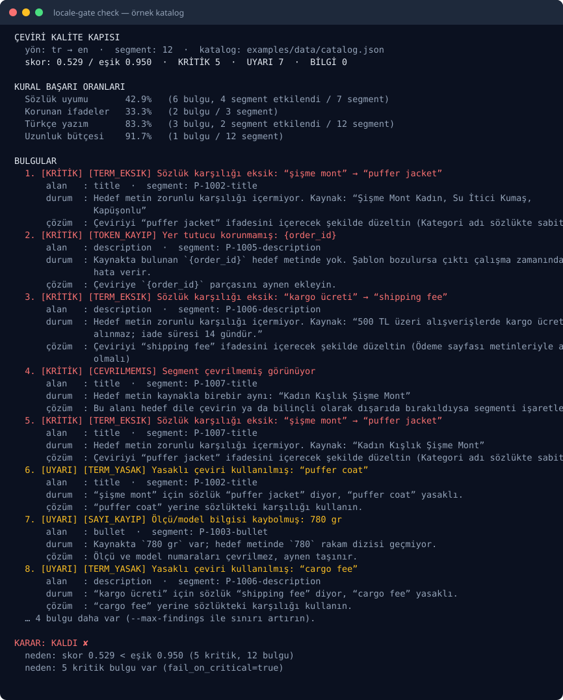

# locale-gate

[](https://github.com/acar32furkan-glitch/locale-gate/actions/workflows/ci.yml)
[](https://www.python.org/)
[](LICENSE)
[](https://docs.astral.sh/ruff/)
[](https://mypy-lang.org/)

**Türkçe** · [English](README.en.md)

**Türkçe ↔ İngilizce ürün içeriği için deterministik çeviri kalite kapısı.** Pazaryeri
listeleme çevirilerini sözlük uyumu, korunan ifadeler (yer tutucu/ölçü/model), Türkçe yazım ve
uzunluk bütçesi açısından denetler; tek bir skor ve **kırmızı/yeşil karar** üretir.

Kurulum yok, 30 saniyede görün:

```bash
git clone https://github.com/acar32furkan-glitch/locale-gate && cd locale-gate
uv sync --all-extras --dev
uv run locale-gate check examples/data/catalog.json --glossary examples/data/glossary.yaml
```



---

## Neden?

Çeviri kalitesi genelde iki uçta bozulur: çevirmen sözlüğe uymaz ("cargo fee" vs "shipping fee") ya
da teknik parçalar sessizce değişir — `{order_id}` yer tutucusu cümleden düşer, "780 gram" "0.78 kg"
olur, "45 x 30 cm" ölçüsünün yarısı kaybolur. Bu hatalar sayfada "normal" görünür, ilk fark eden
müşteri olur.

locale-gate bunu **CI'da yakalanabilir** hâle getirir: aynı girdi her zaman aynı skoru ve aynı
bulguları üretir (hiçbir ölçüm LLM'e ya da ağa bağlı değildir — bkz.
[ADR-0001](docs/adr/0001-deterministic-gate.md)), ve `--fail-under` eşiğinin altına düşen bir
çeviri sürümü merge edilemez.

## Dört kural

| Kural | Ne denetler | Örnek yakaladığı hata |
|-------|-------------|-----------------------|
| `terminology` | Sözlükteki zorunlu karşılıklar ve yasaklı varyantlar | “cargo fee” yazılmış, sözlük “shipping fee” diyor |
| `tokens` | Yer tutucu, HTML etiketi, bağlantı, ölçü ve model numaraları | `{order_id}` çeviride kaybolmuş · 780 gram → 0.78 kg |
| `turkish` | Diakritikler, `i/İ` büyük harf kuralı, çevrilmemiş segment | “Urun Ozellikleri” · “ISTANBUL” (doğrusu “İSTANBUL”) |
| `length` | Alan karakter sınırı ve kaynağa göre uzama oranı | 70 karakterlik başlık alanına 85 karakter |

Kod listesi, eşikler ve gerekçeler: **[docs/rules.md](docs/rules.md)**

```bash
uv run locale-gate rules                                   # kural seti + ağırlıklar
uv run locale-gate check examples/data/catalog.json --json  # ajan/CI için JSON sözleşmesi
uv run locale-gate eval examples/golden                     # altın set regresyonu
```

## CI'da kullanımı

```yaml
- name: Çeviri kalite kapısı
  run: uv run locale-gate check content/catalog.json --glossary content/glossary.yaml --github-summary
```

`--github-summary` iş özetine (Actions sekmesi) Markdown raporu ekler; komut kapı düşerse **1**
koduyla çıkar ve PR'ı kırar. Katalog JSON veya CSV olabilir (`id,field,source,target,limit`).

## Kendi eşikleriniz

```toml
# locale-gate.toml
gate = 0.98
fail_on_critical = true
max_expansion = 1.4

[field_limits]
title = 60
bullet = 120
```

```bash
uv run locale-gate check catalog.json --glossary glossary.yaml --config locale-gate.toml --fail-under 0.9
```

## Mimari

```text
catalog.json ─┐
glossary.yaml ├─→ rules/ (terminology · tokens · turkish · length) ─→ gate.py ─→ Report ─→ cli/render
config.toml  ─┘        (saf fonksiyonlar)                            (skor+karar)
```

- `rules/` içindeki her kural saf fonksiyondur: IO yok, saat yok, rastgelelik yok.
- Her kural kendi **kapsamını** bildirir; hiç denenmemiş bir kural skoru yapay olarak yükseltemez.
- Skor, kural ağırlıklarının normalize edilmiş ortalamasıdır; geçme kararı ayrıca kritik bulgu sayısına bakar.
- Ayrıntı: [docs/architecture.md](docs/architecture.md) · kararlar: [docs/adr/](docs/adr/)

## Kalite

```bash
uv run ruff check . && uv run ruff format --check .
uv run mypy                              # strict
uv run pytest --cov=locale_gate
uv run locale-gate eval examples/golden   # altın set: kuralların davranış sözleşmesi
```

## Sınırlar

- **LLM kullanmaz:** anlam/akıcılık denetimi yapmaz, yalnızca mekanik ve sözlük temelli hataları
  yakalar. Yaratıcı çeviri kalitesi insan değerlendirmesi ister (yol haritasında opsiyonel
  "LLM hakem" var).
- **İki dil çifti:** `tr→en` ve `en→tr`. Başka diller yapılandırmayla değil, kural eklenerek açılır.
- **Türkçe kurallar dil bilgisine dayanır, tahmin etmez:** diakritik kuralı yalnızca kaynak metinde
  doğru yazım varken uyarır; "doğru olan kelimeyi" hatalı saymaz.

## Katkı

[CONTRIBUTING.md](CONTRIBUTING.md) · [CODE_OF_CONDUCT.md](CODE_OF_CONDUCT.md) ·
[SECURITY.md](SECURITY.md) · değişiklikler: [CHANGELOG.md](CHANGELOG.md)

## Lisans

[MIT](LICENSE) © 2026 Furkan Acar (acar32furkan-glitch)
