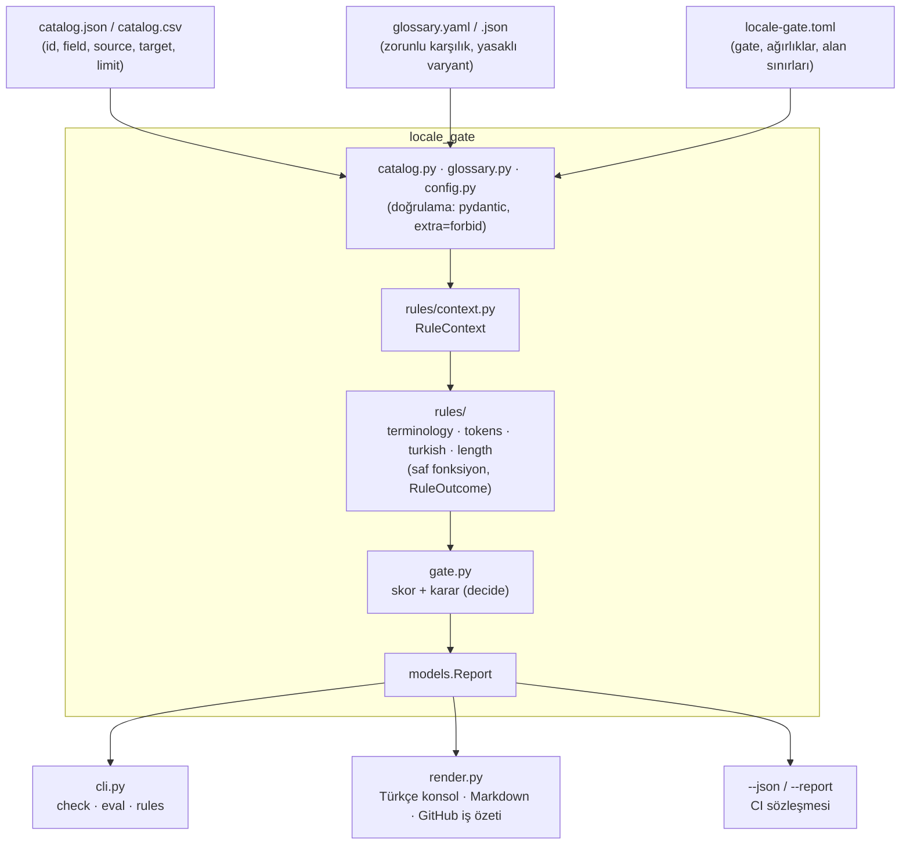

# Mimari

Üç katman, tek yönlü akış: girdi → kurallar → karar → çıktı. Hiçbir katman ağa çıkmaz, saat okumaz
veya rastgelelik kullanmaz (`now` dışarıdan verilir), bu yüzden aynı girdi her zaman aynı skoru
üretir.

## Katmanlar

| Modül | Sorumluluk | Notlar |
|-------|-----------|--------|
| `catalog.py` | Segment listesini yükler (JSON/CSV) | Bozuk satırda satır numarasıyla hata verir |
| `glossary.py` | Sözlüğü yükler ve terim desenlerini derler | Türkçe harf duyarlı kelime sınırı |
| `config.py` | Eşikler, ağırlıklar, alan sınırları | TOML/JSON; bilinmeyen alan reddedilir (yazım hatası koruması) |
| `rules/` | Dört bağımsız kural | Her kural `RuleContext` alır, `RuleOutcome` döndürür |
| `gate.py` | Kuralları çalıştırır, skoru ve kararı üretir | `decide()` iki bağımsız kapı: skor ve kritik bulgu |
| `golden.py` | Altın set (regresyon) koşusu | Beklenen kodlar segment bazında karşılaştırılır |
| `render.py` | İnsan tarafı çıktı | Konsol, Markdown, Actions iş özeti |
| `cli.py` | Komutlar ve çıkış kodları | `0` geçti · `1` kapı düştü · `2` girdi hatası |

## Neden `rules/` içinde `context.py` ayrı?

Kural modülleri kural sözleşmesine (`RuleContext`, `RuleOutcome`) ihtiyaç duyar, motor da onları
kaydeder. Sözleşmeyi `rules/__init__.py` içinde tutmak dairesel import yaratır; bu yüzden sözleşme
ayrı bir modülde durur ve herkes oradan okur.

## Kapsam (`checked`) neden önemli?

Bir kural yalnızca gerçekten baktığı segmentler üzerinden puanlanır. Örnek: sözlük kuralı 100
segmentlik bir katalogda yalnızca 7 segmentte terim buluyorsa, skoru o 7 segment üzerinden hesaplanır.
Aksi hâlde az veriyle çalışan bir kural, hiç çalışmayan bir kural gibi görünür ve skoru yapay olarak
yükseltir ya da düşürür.

## Genişletme noktaları

1. **Yeni kural:** `rules/` içine `check(context) -> RuleOutcome` fonksiyonu yaz, `RULES` sözlüğüne ve
   `RULE_LABELS` etiketlerine ekle, `config.weights`e ağırlık ver. Testte `RuleOutcome.checked`
   davranışını ayrıca doğrula.
2. **Yeni dil çifti:** `tok` kuralları dil bilgisine bağlıdır; yeni bir çift için yeni kural modülü
   yazmak (ve `locales`i genişletmek) gerekir — kural motoru dil-agnostik değildir, bilinçli olarak.
3. **CI'ya bağlama:** `locale-gate check ... --json --report out.json` çıktısını kendi panonuza
   besleyin; sözleşme `tests/test_cli.py` içinde sabitlenmiştir.
